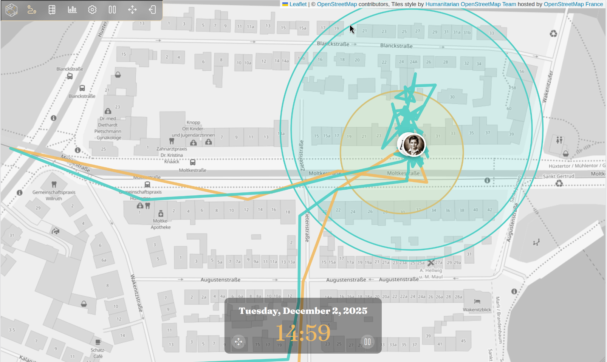
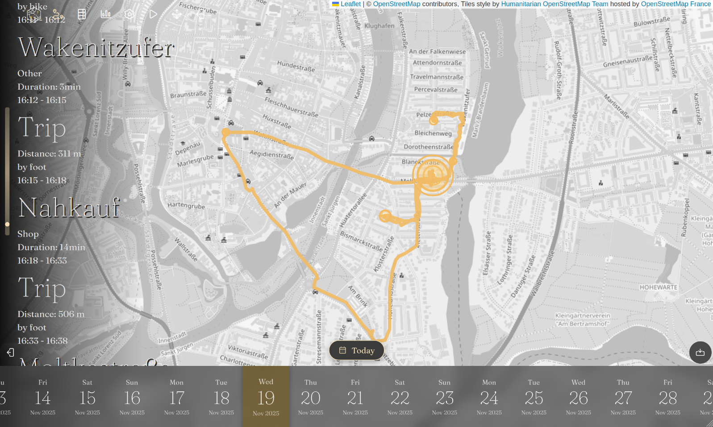

**Reitti** is a self-hosted personal location tracking and analysis application that helps you understand your movement
patterns and significant places. The name comes from Finnish, meaning *"route"* or *"path"*.

---

## Features

### Map & Timeline


*The main view — interactive timeline on the left, live map on the right.*

- **Interactive Timeline** – Daily timeline showing visits and trips with duration and distance info.
- **Visit & Trip Detection** – Automatically identifies places you spend time and tracks movements between them,
  including transport-mode detection (walking, cycling, driving).
- **Significant Places** – Recognize and name the locations you visit frequently.
- **Raw GPS Tracks** – Visualize your complete movement path.
- **Multi-User View** – See all your family and friends on a single map.
- **Live Mode** – Watch incoming data appear on the map automatically — perfect for a kiosk display in fullscreen.

### Live Location Sharing



*Live location sharing — follow family and friends on a single map, across instances, or via magic links.*

Reitti lets you share your live location with others — and see theirs in return.

- **Same-instance sharing** – Connect with other users on your Reitti instance and follow each other's positions in real
  time.
- **Federation** – Connect to other Reitti instances to share locations across servers. Your data stays on your own
  server; only live positions are exchanged with trusted instances you configure.
- **Magic Links** – Share a link with anyone — even people without an account on your instance. They'll be able to see
  your live position (and optionally your recent track) for as long as the link remains valid. Great for sharing your
  ETA with friends or letting someone follow your journey.

> See the [Live Sharing Guide](https://www.dedicatedcode.com/projects/reitti/5.0/usage/share-access/) for setup details.

### Devices

<video width="100%" autoplay loop muted playsinline>
  <source src=".github/screenshots/workbench.webm" type="video/webm">
</video>

*The workbench — drag misplaced GPS points to their correct location and stitch data from different devices together.*

Reitti supports tracking **multiple devices** per user. Data ingested into the default device is automatically stitched
together into a single personal timeline. For other devices, you can use the workbench to manually stitch their data by
selecting the device and a time range — so you never lose a moment, even when you switch between your phone, a dedicated
GPS logger, or other sources.

The workbench also lets you clean up your data directly on the map:

- **Move GPS points** – Drag misplaced points to their correct location.
- **Delete GPS points** – Remove outliers or erroneous data with one click.

> See the [Devices Guide](https://www.dedicatedcode.com/projects/reitti/5.0/configurations/devices/) for setup details.

### Custom Map Styles


*Custom map styles — the same location rendered with different styles.*

You are no longer locked into a single look. Reitti lets you fully customize how your map appears:

- **Upload** your own map style files.
- **Link** to remote style URLs (e.g. from [MapTiler](https://maptiler.com), [Stadia Maps](https://stadiamaps.com), or
  your own tile server).
- Switch between styles instantly from the map view.

> See the [Map Styles Guide](https://www.dedicatedcode.com/projects/reitti/5.0/configurations/map-styles/) for details.

### Photos



*Photo integration — photos from Immich appear on your timeline at the locations where they were taken.*

- Integrate with a self-hosted [Immich](https://github.com/immich-app/immich) server.
- Photos taken at specific locations and dates appear on your timeline.
- Full-screen photo viewer with keyboard navigation and organized galleries.

### Statistics


*Statistics — distance charts, top places, and transport-mode breakdowns.*

Get insights into your movement patterns with summary statistics and visualizations.

### Privacy & Self-Hosting

- Your location data **never leaves your server**.
- Live location sharing only transmits your current position to instances and users you explicitly trust.
- Magic links are revocable at any time and only expose what you choose to share.
- Reverse geocoding works out of the box using hosted [Paikka](https://www.dedicatedcode.com/projects/paikka/)
  instances — or configure your own geocoder if you prefer.
- Deploy on your own infrastructure with Docker.
- Multi-user support with full data isolation.
- OIDC / single sign-on support.

---

## Quick Start

The fastest way to try Reitti is with Docker Compose:

```bash
mkdir reitti && cd reitti
wget https://raw.githubusercontent.com/dedicatedcode/reitti/refs/heads/main/docker-compose.yml
docker compose up -d
```

Then open **http://localhost:8080**. On first login you'll be prompted to set a new admin password. A default API token
is created automatically for you, so you can jump straight into connecting your devices.

> **ARM64 users** (Apple Silicon, etc.):
> Until [postgis/docker-postgis#216](https://github.com/postgis/docker-postgis/issues/216) is resolved, change the PostGIS
> image in the compose file to `imresamu/postgis:17-3.5-alpine`.

### Next Steps

1. **Set Up Devices** – `Settings → Devices` → see
   the [Devices Guide](https://www.dedicatedcode.com/projects/reitti/5.0/configurations/devices/).
2. **Connect a Mobile App** – `Settings → Integrations` → see
   the [Mobile App Guide](https://www.dedicatedcode.com/projects/reitti/5.0/integrations/mobile-apps/). Your default API
   token is ready to use.
3. **Import Data** – `Settings → Import Data` → see
   the [Data Import Guide](https://www.dedicatedcode.com/projects/reitti/5.0/usage/import-data/).
4. **Customize Your Map** – `Settings → Map Styles` → see
   the [Map Styles Guide](https://www.dedicatedcode.com/projects/reitti/5.0/configurations/map-styles/).
5. **Share Your Live Location** – `Settings → Live Sharing` → see
   the [Live Sharing Guide](https://www.dedicatedcode.com/projects/reitti/5.0/usage/live-sharing/).

---

## Data Import & Integrations

| Source                 | Type        | Docs                                                                                                 |
|------------------------|-------------|------------------------------------------------------------------------------------------------------|
| GPX files              | File upload | [Guide](https://www.dedicatedcode.com/projects/reitti/5.0/api/gpx-import/)                           |
| Google Takeout JSON    | File upload | [Guide](https://www.dedicatedcode.com/projects/reitti/5.0/usage/import-data/)                        |
| Google Timeline Export | File upload | [Guide](https://www.dedicatedcode.com/projects/reitti/5.0/usage/import-data/)                        |
| GeoJSON                | File upload | [Guide](https://www.dedicatedcode.com/projects/reitti/5.0/api/geojson/)                              |
| OwnTracks              | Real-time   | [Guide](https://www.dedicatedcode.com/projects/reitti/5.0/integrations/mobile-apps/#owntracks-setup) |
| GPSLogger              | Real-time   | [Guide](https://www.dedicatedcode.com/projects/reitti/5.0/integrations/mobile-apps/#gpslogger-setup) |
| Overland               | Real-time   | [Guide](https://www.dedicatedcode.com/projects/reitti/5.0/integrations/mobile-apps/#overland-setup)  |
| Home Assistant         | Real-time   | [Guide](https://www.dedicatedcode.com/projects/reitti/5.0/integrations/home-assistant/)              |
| REST API               | Custom      | [Guide](https://www.dedicatedcode.com/projects/reitti/5.0/api/ingest/)                               |

---

## Configuration

### Docker Image Tags

Reitti publishes several Docker image tags to serve different needs:

| Tag       | Stability     | Use Case                                                                                                                                                                                                                                     |
|-----------|---------------|----------------------------------------------------------------------------------------------------------------------------------------------------------------------------------------------------------------------------------------------|
| `latest`  | Stable        | Points to the most recent stable release. Use this if you want updates as soon as they're published and don't mind occasionally pulling a new major version.                                                                                 |
| `5`       | Stable        | Points to the latest release within the 5.x series. You get bug fixes and minor features without the risk of a major version jump — a good balance of freshness and stability.                                                               |
| `5.0.2`   | Stable        | A pinned specific release. Use this in production when you need reproducible deployments and full control over when you upgrade.                                                                                                             |
| `develop` | Bleeding edge | Rebuilt on every push to `main`. Includes features and fixes that haven't been released yet. Use this if you want to test upcoming changes or contribute — but expect occasional rough edges.                                                |
| `next`    | Alpha         | Represents the next major version in development. **Do not use in production** — the database schema may change in ways that aren't backward-compatible, which can corrupt or lose your data. Only for testing the next major release cycle. |

> **Recommendation:** For most self-hosters we recommend using the major-version tag (e.g. `reitti:5`). It gives you bug
> fixes and new features within the current major version automatically, while protecting you from breaking changes that
> come with a new major release. Pin a full version (e.g. `reitti:5.0.2`) if you need strict reproducibility — for
> example, in automated deployments or when you want to upgrade manually after testing.

### Key Environment Variables

| Variable                | Description                                       | Default    |
|-------------------------|---------------------------------------------------|------------|
| `POSTGIS_HOST`          | PostgreSQL host                                   | `postgis`  |
| `POSTGIS_PORT`          | PostgreSQL port                                   | `5432`     |
| `POSTGIS_DB`            | PostgreSQL database name                          | `reittidb` |
| `POSTGIS_USER`          | PostgreSQL user                                   | `reitti`   |
| `POSTGIS_PASSWORD`      | PostgreSQL password                               | `reitti`   |
| `REDIS_HOST`            | Redis host                                        | `redis`    |
| `REDIS_PORT`            | Redis port                                        | `6379`     |
| `REDIS_PASSWORD`        | Redis password                                    | —          |
| `OIDC_ENABLED`          | Enable OpenID Connect login                       | `false`    |
| `OIDC_ISSUER_URI`       | OIDC provider issuer URI                          | —          |
| `OIDC_CLIENT_ID`        | OIDC client ID                                    | —          |
| `OIDC_CLIENT_SECRET`    | OIDC client secret                                | —          |
| `BASE_PATH`             | Serve Reitti under a sub-path                     | `/`        |
| `DANGEROUS_LIFE`        | Enable data-reset features (**use with caution**) | `false`    |
| `PROCESSING_BATCH_SIZE` | Geo points processed per batch                    | `1000`     |

> For the full list of environment variables, deployment options, and OIDC setup, see
> the [Infrastructure Documentation](https://www.dedicatedcode.com/projects/reitti/5.0/infrastructure/oidc/).

---

## Backup

- **Back up regularly:** the PostGIS database **and** the Reitti storage volume (uploaded files).
- Redis and other stateless services do **not** need to be backed up.

→ [Backup Guide](https://www.dedicatedcode.com/projects/reitti/5.0/backup/)

---

## Contributing & Support

Contributions are welcome! Please feel free to open a Pull Request.

**Get support:**

- Open a [new issue](https://github.com/dedicatedcode/reitti/issues/new/choose)
- Tag [@danielgraf](https://discuss.tchncs.de/u/danielgraf) on Lemmy
- Join **#reitti** on [libera.chat](https://libera.chat)

## Translations

We use [Weblate](https://hosted.weblate.org/engage/reitti/) for translations. Help us add your language!

[](https://hosted.weblate.org/engage/reitti/)

---

## Star History

[](https://www.star-history.com/#dedicatedcode/reitti&Date)

## License

This project is licensed under the **GNU Affero General Public License v3.0** (AGPL-3.0). See the [LICENSE](LICENSE)
file for details.